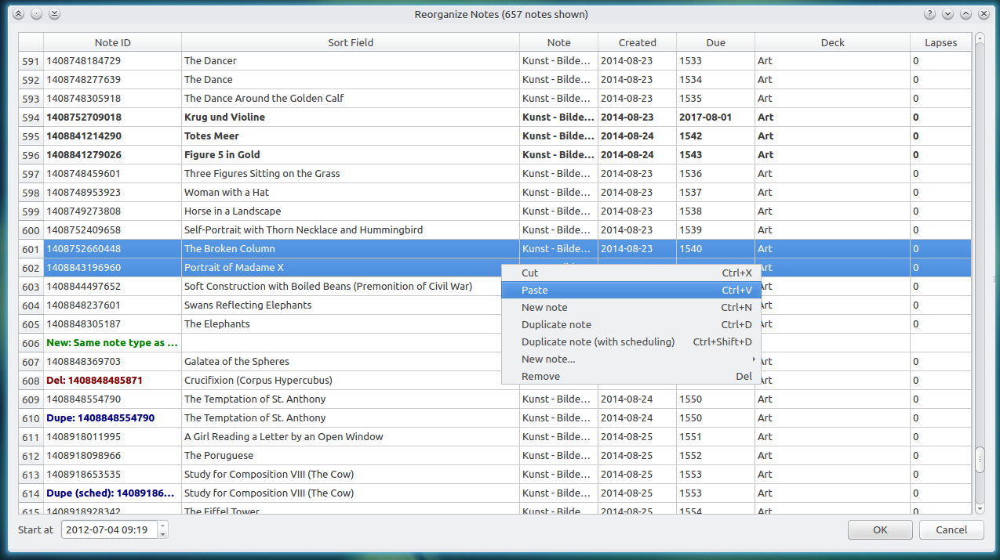
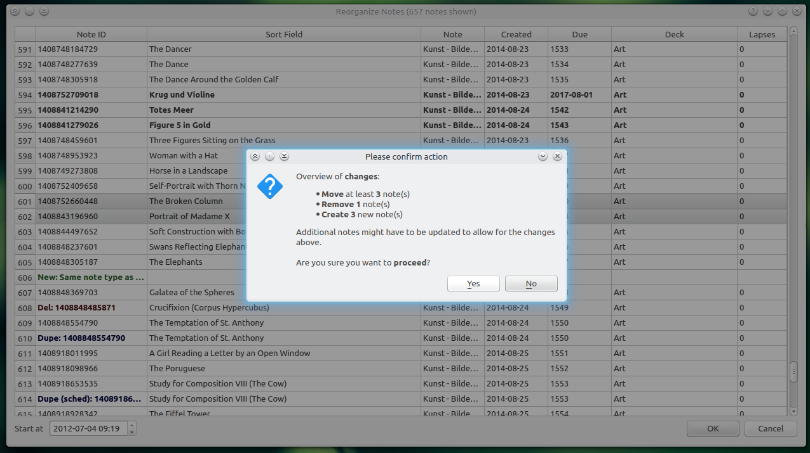

## Note Organizer Add-on for Anki

Extends Anki's card browser with an easy-to-use dialog that provides the user with a multitude of different ways to organize and restructure their note collection. Actions supported by the add-on include changing the note order, inserting new notes at specific positions, and the ability to duplicate notes alongside their scheduling.

<!-- MarkdownTOC -->

- [Screenshots](#screenshots)
- [Installation](#installation)
- [Documentation](#documentation)
- [Credits and License](#credits-and-license)

<!-- /MarkdownTOC -->

### Screenshots

### Installation

*AnkiWeb*

[Link to the add-on on AnkiWeb]()

*Manual installation*

1. Go to *Tools* -> *Add-ons* -> *Open add-ons folder*
2. Find and delete `Note Organizer.py` and `note_organizer`
3. Download and extract the latest add-on release from the [releases tab](https://github.com/Glutanimate/note-organizer/releases)
4. Move `Note Organizer.py` and `note_organizer` into the add-ons folder
5. Restart Anki

### Documentation

**Important Notes**

There are a few important points you need to be aware of before using this add-on:

*Rationale behind the add-on*

The only persistent sorting criterion across reviews in Anki is the note creation time. By modifying this time artificially, the add-on allows you to define a custom note sorting order. This is different from all of the other repositioning tools Anki ships with because they only temporarily affect the order of introduction of new cards. Any changes performed to the positioning of new cards get lost once they enter the learning phase.

*Implications for your collection*

The main limitation of this add-on lies in the fact that Anki uses the note creation time as the main identifier for its database entries (the so called note ID, or database key). For that reason changes performed by the note organizer will always trigger a full database sync. It also means that this add-on is inherently more dangerous to use than any of Anki's inbuilt tools. Please make sure to familiarize yourself with Anki's backup process before deciding to use this add-on, especially in its current beta state.

Another important point to emphasize is that some changes can have a cascading effect on your note collection. For instance, when inserting a new note between two existing ones the add-on has to make sure to select a creation time that is right in-between those two. In some instances – that are fortunately rare – this can only be achieved by incrementing the creation time of all subsequent notes. When there's no room to squish-in the add-on has to make that room. The increments are in the order of milliseconds, so they won't affect your general use of Anki, but they do mean that the add-on might have to modify several dozen notes just to reposition one. The add-on will inform you of all collateral changes to your note collection after the processing is done.

*Performance implications*

Gathering all of the required information to display your notes takes time, and so does modifying the database once you've confirmed your changes. That's why both invoking the dialog and performing changes is not instant. Delays of a few seconds are not unusual for decks with thousands of notes. This does also depend on your machine, though.

**Use Cases**

Contrary to what you might be thinking at this point, setting a custom note sorting order will *not* allow you to go through your regular reviews in a specific order. What it will provide you with, however, is:

- the ability to review cards in a consistent sorting order using *filtered decks* or the [Advanced Previewer add-on](https://ankiweb.net/shared/info/544521385)
- the ability to freely determine how new cards are introduced in the learning phase
- the ability to always go back and learn your cards in a specific order when starting from scratch after a longer hiatus
- the ability to restructure your decks in preparation of sharing them with others

Aside from moving notes around, the add-on also allows you to:

- adjust the due order of new cards
- insert new notes between existing ones
- duplicate notes while optionally copying their scheduling information over. This can be useful for splitting-up larger notes into smaller ones.

**General Use**

From Anki's card browser, you can invoke the note organizer window by using the hotkey <kbd>Ctrl</kbd> + <kbd>G</kbd> or by clicking on the corresponding menu entry that the add-on supplies.

Using the note organizer is very easy: Most actions supported by the add-on are available through a context-menu which you can invoke by right-clicking on any of the entries in the note table. Corresponding hotkeys are listed next to the actions and allow you to also use the add-on with your keyboard.

You can move notes either by cutting and pasting them, or by utilizing your mouse to drag and drop entries. Multiple notes can be moved at the same time by selecting multiple entries.

Both the columns and entries in the note table are fully defined by Anki's card browser. Any notes visible in the browser while invoking the add-on will also be listed in the notetable. The same rationale applies to the columns, aside from the fact that the column arrangement does not follow the browser, but can rather be customized in the note organizer.

While performing your changes in the note organizer, Anki's card browser will follow along and always display the active entry in the note table. This synchronization works both ways and allows you to get a better overview of each note's contents. Synchronization to the previewer window is also supported.

The date and time entry at the bottom left corner allows you to set the creation time for the first note. This can be useful when moving a newly created note to the very top of the list.

Clicking on "OK" will prompt you with a confirmation dialog, listing all of the changes that the add-on will perform. Make sure to always double-check whether all of these are correct. The add-on *does* set a recovery point before performing its changes – which can then be reverted to through Anki's undo feature (<kbd>Ctrl</kbd> + <kbd>Z</kbd>) – but it's better to be safe than sorry.

### Credits and License

*Note Organizer* is *Copyright © 2017 [Aristotelis P.](https://github.com/Glutanimate)*

This add-on was developed on a commission by a fellow Anki user who would like to remain anonymous. All credit for the original idea goes to them.

I'm always happy for new add-on commissions. If you'd like to hire my services to work an add-on or new feature, please feel free to reach out to me through *ankiglutanimate [αt] gmail . com*.

Licensed under the [GNU AGPL v3](http://www.gnu.de/documents/gpl-3.0.en.html). 